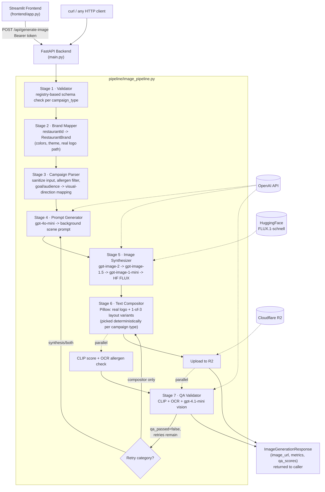

# Camion Image Generator

Standalone pipeline that generates campaign marketing images for restaurant brands using a
seven-stage AI pipeline. Built as a FastAPI service with a Streamlit frontend.

---

## Architecture



Parallelism baked in: Stage 6 and CLIP+OCR run simultaneously; R2 upload and vision QA
run simultaneously. Retry routing distinguishes synthesis failures (re-run Stage 4+5+6) from
compositor-only failures (re-run Stage 6 only, no new image generation charge).

---

## Prerequisites

- Python 3.11+
- Tesseract OCR: `choco install tesseract` (Windows) or `apt install tesseract-ocr` (Linux)
- OpenAI API key with access to: `gpt-4o-mini`, `gpt-4.1-mini`, `gpt-image-2`, `gpt-image-1.5`, `gpt-image-1-mini`
- Cloudflare R2 bucket (free tier: 10 GB storage, 1M requests/month)
- HuggingFace token (optional, enables free FLUX.1-schnell fallback)

---

## Getting Started

### 1. Clone and install

```bash
git clone https://github.com/TamkeenSara874/camion-image-gen.git
cd camion-image-gen
pip install -r requirements.txt
```

### 2. Configure environment

```bash
cp .env.example .env
# Edit .env with your credentials
```

Required variables:

| Variable | Description |
|----------|-------------|
| `OPENAI_API_KEY` | OpenAI API key |
| `API_BEARER_TOKEN` | Secret token for the API (choose any string) |
| `R2_ACCOUNT_ID` | Cloudflare account ID |
| `R2_ACCESS_KEY_ID` | R2 API token access key |
| `R2_SECRET_ACCESS_KEY` | R2 API token secret key |
| `R2_BUCKET_NAME` | R2 bucket name |
| `R2_PUBLIC_URL` | R2 public URL (e.g. `https://pub-xxx.r2.dev`) |

### 3. Start the backend

```bash
uvicorn main:app --reload --port 8010
```

Port 8010, not 8000 -- 8000 is used by this machine's arm-chatbot backend container.
Change it freely if that's not true in your environment; just keep `PORT` and
`API_URL` in `.env` in sync with whatever you pick.

CLIP weights (~350 MB) download from HuggingFace on first startup. Subsequent starts are fast.

### 4. Start the frontend

```bash
streamlit run frontend/app.py
```

Open http://localhost:8501

### 5. Run the API directly

```bash
curl -X POST http://localhost:8010/api/generate-image \
  -H "Authorization: Bearer $API_BEARER_TOKEN" \
  -H "Content-Type: application/json" \
  -d @sample_payloads/mijos_2_menu_items.json
```

---

## Running with Docker

```bash
cp .env.example .env
# Fill in your credentials

docker-compose up --build
```

Backend: http://localhost:8010
Frontend: http://localhost:8501

Note: the backend Docker image is large (~3 GB) because PyTorch is required for CLIP.
CLIP weights are downloaded at container startup (not baked into the image).

---

## Makefile Targets

| Command | Description |
|---------|-------------|
| `make install` | Install all dependencies |
| `make dev` | Start backend with hot reload |
| `make frontend` | Start Streamlit UI |
| `make test` | Run all tests |
| `make batch` | Run all 6 sample payloads through the full pipeline |
| `make lint` | Ruff lint check |
| `make format` | Ruff auto-format |
| `make build` | Build Docker image |
| `make run` | Start full stack via docker-compose |

---

## Batch Run

Generates images for all 6 sample payloads and writes `outputs/batch_summary.json`:

```bash
# Full pipeline (~$0.30 total, generates images)
python run_batch.py

# Prompts only (~$0.006 total, no images generated)
python run_batch.py --prompts-only
```

---

## Test Suite

```bash
pytest tests/ -v
```

183 tests. Integration tests mock all external calls (OpenAI, R2).

---

## API Reference

### POST /api/generate-image

**Header:** `Authorization: Bearer <API_BEARER_TOKEN>`

**Request body:** see `sample_payloads/` for examples. Key fields:

```json
{
  "campaign_type": "Menu Items",
  "restaurantId": 2,
  "campaign_vars": { "name": "...", "description": "...", "price": "12" },
  "orientation": "Landscape",
  "channels": ["Email"],
  "campaign_brand_voices": "Casual, Friendly",
  "campaign_goals": "Increase Sales",
  "campaign_audiences": ["New", "Potential"],
  "campaign_guest_tags": [],
  "cta": false,
  "custom_prompt": null
}
```

**Response:**

```json
{
  "image_url": "https://pub-xxx.r2.dev/2/uuid.jpg",
  "model_used": "gpt-image-2",
  "attempt_number": 1,
  "orientation_preserved": true,
  "restaurant_name": "Mijo's Taqueria",
  "alt_text": "Mijo's Taqueria - Baja Fish Taco",
  "qa_passed": true,
  "qa_retries": 0,
  "clip_score": 0.27,
  "qa_scores": { "brand_fidelity": 4, "composition": 5 },
  "metrics": {
    "total_latency_ms": 19430,
    "total_cost_usd": 0.0438,
    "stage_breakdown": [...]
  }
}
```

**Error codes:**

| Status | Cause |
|--------|-------|
| 401 | Invalid bearer token |
| 422 | Unknown campaign type, invalid restaurant ID, missing required field |
| 429 | Daily image limit reached for this restaurant |
| 500 | All image generation models failed |

### GET /health

Returns `{"status": "ok"}`. Used by Docker HEALTHCHECK.

### GET /health/ready

Returns 200 if OpenAI key and R2 credentials are configured, 503 otherwise.

---

## Supported Campaign Types

| Type | Required `campaign_vars` fields |
|------|--------------------------------|
| `Spotlights` | `name`, `description` |
| `Menu Items` | `name`, `description` (+ optional: `price`, `item_category`, `item_menu`) |
| `Deals` | `name`, `deal_type`, `deal_type_vars` (+ optional: `description`, dates, `promo_code`) |

Adding a new campaign type: add a Pydantic model to `schemas/campaign_types.py` and a
YAML template to `prompts/`. No pipeline code changes required.

---

## Supported Restaurants

| ID | Name | Theme |
|----|------|-------|
| 2 | Mijo's Taqueria | Vibrant, festive Mexican |
| 4 | Flights Restaurant | Sophisticated, wine-forward American |

Adding a new restaurant: add a JSON object to `config/restaurant_brands.json`, run
`scripts/extract_brand_colors.py` and `scripts/fetch_brand_logo.py`. No code changes.
See `docs/brand_notes.md` for the full walkthrough.

---

## Campaign Layouts & Brand Identity

Every campaign type has **3 distinct layout variants** (`stages/text_compositor.py`), not
one template reused for every campaign. Which variant a given campaign renders with is
picked deterministically by hashing `(restaurantId, campaign_type, campaign_name)` --
the same payload always renders identically (cacheable, testable, reproducible for QA
review), but two different campaigns of the same type land on different structures instead
of all looking like clones of each other:

| Campaign type | Variant 0 | Variant 1 | Variant 2 |
|---|---|---|---|
| **Menu Items** | Header bar + full-bleed photo + bottom gradient caption (name, price) | Corner logo badge, no header bar; centered name; price as a floating accent-color tag | Right-side brand-color panel: logo, name, price, description |
| **Deals** | Header bar + full-bleed photo + bottom gradient band with large offer callout | Corner logo badge; offer rendered as a huge centered stamp-style callout | Left-side brand-color panel: logo, deal name, offer |
| **Spotlights** | Left-side brand-color panel: logo badge, headline, offer | Mirrored right-side panel | Corner logo badge, full-bleed atmospheric photo, centered poster-style headline |

An unrecognized `campaign_type` falls back to the Menu Items variant pool rather than
crashing (`_VARIANTS_BY_TYPE.get(ctx.campaign_type, _VARIANTS_BY_TYPE["Menu Items"])`).

**Real logos, never generated.** The image model is explicitly told to draw no logos,
text, or signage in every prompt template — a diffusion model has no pixel-exact memory
of a specific restaurant's mark and would otherwise hallucinate a plausible-looking fake
that changes on every generation. The actual logo file (`config/logos/{restaurantId}.png`,
sourced via `scripts/fetch_brand_logo.py`) is pasted onto the image deterministically by
the Pillow compositor instead, on a white card so it stays legible against any brand color.
If a restaurant has no logo sourced yet, the compositor degrades to a typed restaurant-name
badge rather than inventing one.

**Goal/audience-aware prompts.** `campaign_goals` and `campaign_audiences` are mapped
(`stages/campaign_parser.py`) to explicit composition and tone directives before reaching
the LLM — e.g. "Increase Item Sales" -> focus tightly on the item as the hero subject;
"Lost" audience -> reactivation-focused and persuasive — rather than leaving the raw label
to the model's interpretation. The Streamlit frontend exposes this as a "Campaign goal"
dropdown (defaulting per campaign type, e.g. Deals defaults to "Increase Deal Sales") with
a live caption showing the resulting visual direction.

---

## Image Generation Models

| Attempt | Model | Cost | Notes |
|---------|-------|------|-------|
| 1 | gpt-image-2 | ~$0.042 | Primary; best quality |
| 2 | gpt-image-2 (sanitized prompt) | ~$0.042 | Retry with safety suffix |
| 3 | gpt-image-1.5 | ~$0.025 | Paid fallback |
| 4 | gpt-image-1-mini | ~$0.011 | Cheapest paid fallback |
| 5 | FLUX.1-schnell (HuggingFace) | Free | Square only; `orientation_preserved=false` |

---

## Trade-offs

**Overlay vs diffusion text** — Diffusion models render typography unreliably. Garbled prices
and misspelled names directly violate the acceptance criteria. Programmatic overlay via Pillow
guarantees correct text at the cost of a slightly more templated appearance. For a marketing
automation system, correctness outweighs visual seamlessness.

**In-process cache** — The payload hash cache is a Python dict, per-Uvicorn-worker. With
`--workers 2`, a repeated request lands on the correct worker only ~50% of the time.
For guaranteed deduplication, run with `--workers 1` or switch the cache to Redis.
The same limitation applies to the per-restaurant daily image counter.

**CLIP weights download at startup** — ViT-B/32 weights (~350 MB) are downloaded from
HuggingFace on first startup. This adds 2-5 minutes to cold start. For production, bake the
weights into the Docker image or mount a pre-populated cache volume.

**Style variance across campaigns** — Three campaigns for the same restaurant generate
independently sampled background scenes. `_apply_brand_tone()` in the compositor blends
every generated photo 6% toward the restaurant's primary hex before overlays are drawn,
giving a consistent tonal anchor, but images will still vary in lighting and photographic
style since each is sampled independently. Production fix: img2img conditioning with a
canonical hero shot as a style reference.

**R2 vs ARM's existing asset storage** — R2 was chosen for standalone evaluation. If ARM
has an existing asset storage layer for customer-facing content, confirm whether images should
be stored there before production deployment.

---

## Deliverables

| # | Deliverable | Location |
|---|-------------|----------|
| 1 | Restaurant brand notes | `docs/brand_notes.md` |
| 2 | Payload field mapping | `docs/payload_mapping.md` |
| 3 | Prompt generator templates | `prompts/*.yaml` |
| 4 | Campaign type parsers | `stages/campaign_parser.py`, `schemas/campaign_types.py` |
| 5 | Restaurant ID to brand mapping (incl. real logos) | `config/restaurant_brands.json`, `config/logos/` |
| 6 | Working image generation pipeline | `pipeline/image_pipeline.py` |
| 7 | 2+ image generation APIs | gpt-image-2 + gpt-image-1.5 + HF FLUX |
| 8 | Generated prompts for all 6 payloads | `outputs/` after `make batch` |
| 9 | Generated images for 4+ payloads | R2 URLs in `outputs/batch_summary.json` |
| 10 | Quality review notes | `docs/quality_review.md` |
| 11 | README with run instructions | this file |
